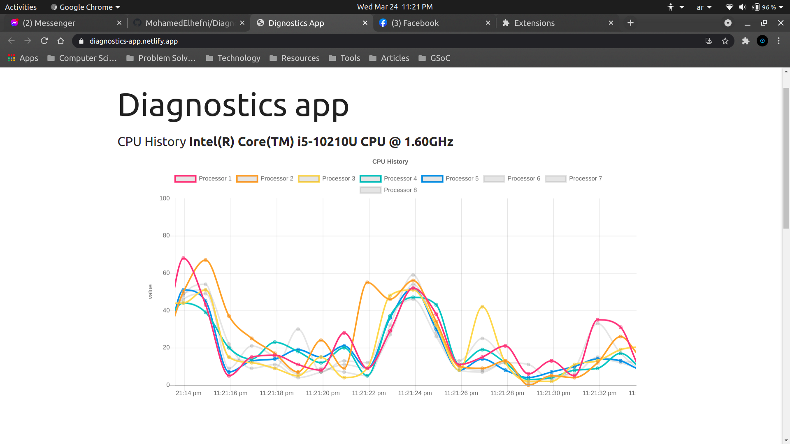
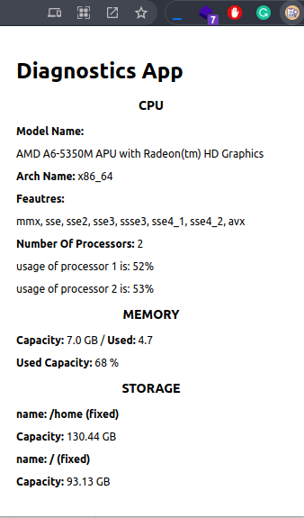
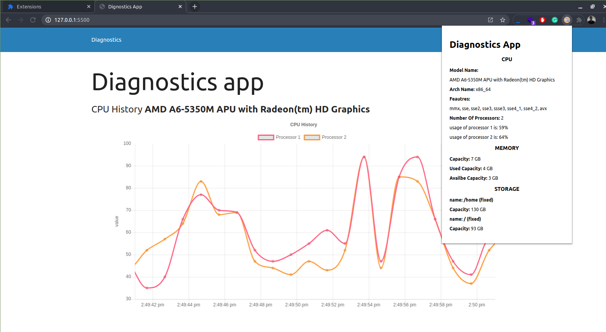
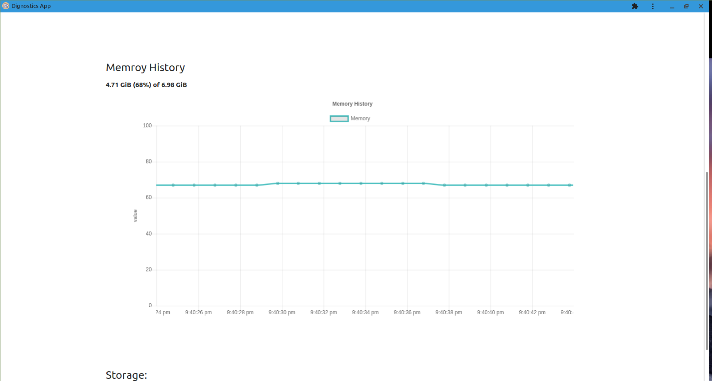
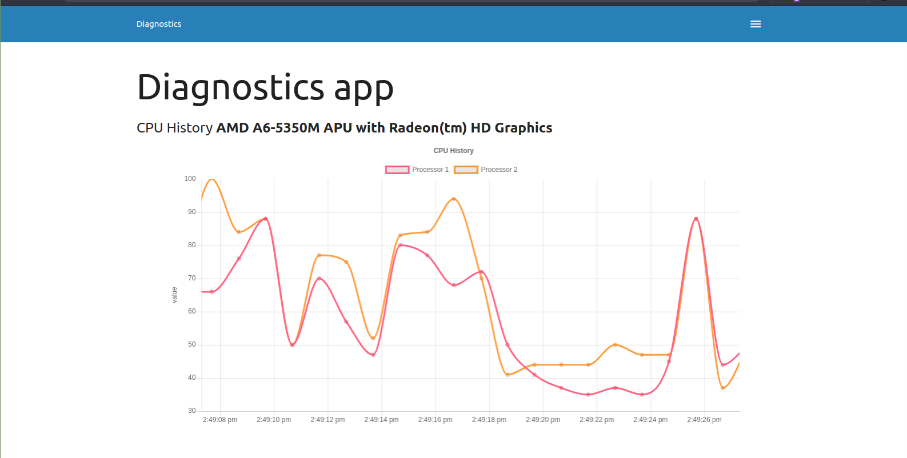

# Sample Diagnostics App
This Repo I created to solve the Starter Bug of GSOC: 2021 [The Bug](https://docs.google.com/document/d/1CltFQ7oIA0TO47xzpRFvvOrfpI9qeJZCMM8QSxjiuNk/edit?resourcekey=0-usYPDX3vZ6xiOQfxYkSG5w#heading=h.23klu77rnpy9)  

first you need to download the repo 
```
git clone https://github.com/MohamedElhefni/Diagnostics-app.git
```
go to [Chrome Extensions](chrome://extensions/) and click Load unpacked and choose **diagnostics-extension Directory**  
after installing the chrome extension you can try live demo from here  
[https://diagnostics-app.netlify.app/](https://diagnostics-app.netlify.app/)

> note: you must install extension first to use the app   

to run the app localy go to **diagnosticsApp Direcotry** and run commands: 
```
npm install
```

```
npm run serve
```

## Images
___






